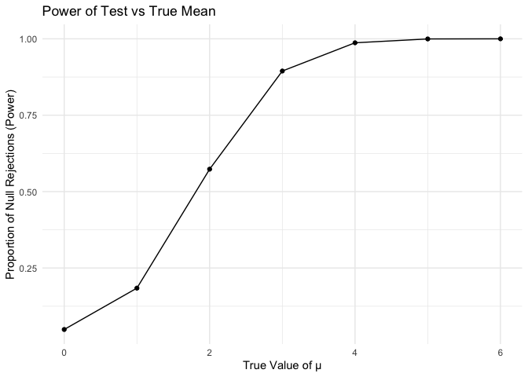
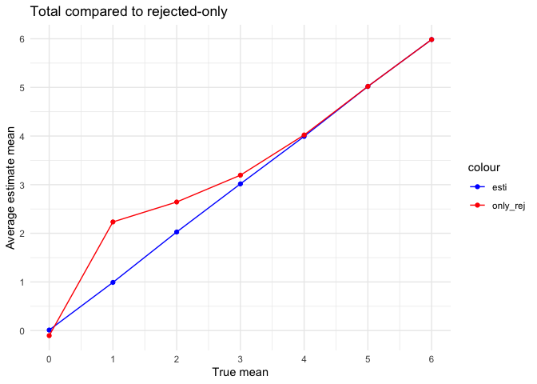

p8105_hw5_ww2745
================
ww2745
2024-11-08

``` r
library(dplyr)
```

    ## 
    ## Attaching package: 'dplyr'

    ## The following objects are masked from 'package:stats':
    ## 
    ##     filter, lag

    ## The following objects are masked from 'package:base':
    ## 
    ##     intersect, setdiff, setequal, union

``` r
library(broom)
library(purrr)
library(tidyverse)
```

    ## ── Attaching core tidyverse packages ──────────────────────── tidyverse 2.0.0 ──
    ## ✔ forcats   1.0.0     ✔ stringr   1.5.1
    ## ✔ ggplot2   3.5.1     ✔ tibble    3.2.1
    ## ✔ lubridate 1.9.3     ✔ tidyr     1.3.1
    ## ✔ readr     2.1.5

    ## ── Conflicts ────────────────────────────────────────── tidyverse_conflicts() ──
    ## ✖ dplyr::filter() masks stats::filter()
    ## ✖ dplyr::lag()    masks stats::lag()
    ## ℹ Use the conflicted package (<http://conflicted.r-lib.org/>) to force all conflicts to become errors

``` r
library(ggplot2)
```

## Problem 1

Suppose you put n people in a room, and want to know the probability
that at least two people share a birthday. For simplicity, we’ll assume
there are no leap years (i.e. there are only 365 days) and that
birthdays are uniformly distributed over the year (which is actually not
the case).

Write a function that, for a fixed group size, randomly draws
“birthdays” for each person; checks whether there are duplicate
birthdays in the group; and returns TRUE or FALSE based on the result.

``` r
dup_birthday = function(n) {
  birthdays = sample(1:365, n, replace = TRUE)
  any(duplicated(birthdays))
}
```

let n be a fix number with value=30

``` r
dup_birthday(30)
```

    ## [1] TRUE

Next, run this function 10000 times for each group size between 2 and
50. For each group size, compute the probability that at least two
people in the group will share a birthday by averaging across the 10000
simulation runs.

``` r
sim_results_df = 
  expand_grid(
    group_size = 2:50,  
    iter = 1:10000      
  ) |> 
  mutate(
    has_shared_birthday = map_lgl(group_size, dup_birthday)
  ) |> 
  group_by(group_size) |> 
  summarize(
    prob = mean(has_shared_birthday),
    .groups = "drop"
  )
```

Make a plot showing the probability as a function of group size, and
comment on your results.

``` r
ggplot(sim_results_df, aes(x = group_size, y = prob)) +
  geom_point() +
  labs(
    title = "Probability of Shared Birthday with Different Group Sizes",
    x = "Group Size",
    y = "Probability of Shared Birthday"
  ) +
  theme_minimal()
```

<!-- --> With the
increasing group size, the probability that at least two people in the
group will share a birthday will increase from 0 and approach 1.

## Problem 2

Make a plot showing the proportion of times the null was rejected (the
power of the test) on the y axis and the true value of 𝜇 on the x axis.
Describe the association between effect size and power.

``` r
sample_size = 30               
sigma = 5           
alpha = 0.05        
mu_values = 0:6     
num_datasets = 5000    

simulate_mean_sd = function(true_mu) {
  data = rnorm(sample_size, mean = true_mu, sd = sigma)
  test_result = broom::tidy(t.test(data, mu = 0))
  tibble(
    mean_estimate = mean(data),
    p_value = test_result$p.value
  )
}

simulation_results_df = 
  expand_grid(
    true_mu = mu_values,
    iteration = 1:num_datasets
  ) |> 
  mutate(
    estimate_df = map(true_mu, simulate_mean_sd)
  ) |> 
  unnest(estimate_df)

power_results = simulation_results_df  |> 
  group_by(true_mu)  |> 
  summarize(
    power = mean(p_value < alpha),
    mean_estimate = mean(mean_estimate),
    mean_rejected_estimate = mean(mean_estimate[p_value < alpha], na.rm = TRUE)
  )
```

``` r
power_results = simulation_results_df  |> 
  group_by(true_mu)  |> 
  summarize(
    power = mean(p_value < alpha),
    mean_estimate = mean(mean_estimate),
    mean_rejected_estimate = mean(mean_estimate[p_value < alpha], na.rm = TRUE)
  )

ggplot(power_results, aes(x = true_mu, y = power)) +
  geom_line() +
  geom_point() +
  labs(title = "Power of Test vs True Mean",
       x = "True Value of μ",
       y = "Proportion of Null Rejections (Power)") +
  theme_minimal()
```

<!-- -->

``` r
ggplot(power_results, aes(x = true_mu)) +
  geom_line(aes(y = mean_estimate), color = "green") +
  geom_point(aes(y = mean_estimate), color = "green") +
  geom_line(aes(y = mean_rejected_estimate), color = "blue", linetype = "dashed") +
  geom_point(aes(y = mean_rejected_estimate), color = "blue") +
  labs(title = "Average Estimate of μ vs True Mean",
       x = "True Value of μ",
       y = "Average Estimate of μ") +
  theme_minimal()
```

    ## Warning: Removed 3 rows containing missing values or values outside the scale range
    ## (`geom_line()`).

    ## Warning: Removed 3 rows containing missing values or values outside the scale range
    ## (`geom_point()`).

<!-- -->

## Problem 3

``` r
homicide = 
  read_csv(
    "data/homicide-data.csv")
```

    ## Rows: 52179 Columns: 12
    ## ── Column specification ────────────────────────────────────────────────────────
    ## Delimiter: ","
    ## chr (9): uid, victim_last, victim_first, victim_race, victim_age, victim_sex...
    ## dbl (3): reported_date, lat, lon
    ## 
    ## ℹ Use `spec()` to retrieve the full column specification for this data.
    ## ℹ Specify the column types or set `show_col_types = FALSE` to quiet this message.

The dataset contains information on 52179 criminal homicides over the
past decade in 50 of the largest American cities. The data include 12
variables, and are primarily victims related – name, race, age, and sex
– in addition to time and location of homicides.

``` r
homicide_sum = homicide|>
  mutate(city_state = paste(city, state, sep = ", ")) |>
  group_by(city_state) |>
  summarize(
    total_homicides = n(),
    unsolved_homicides = sum(disposition %in% c("Closed without arrest", "Open/No arrest")),
    .groups = "drop" 
  )


homicide_sum
```

    ## # A tibble: 51 × 3
    ##    city_state      total_homicides unsolved_homicides
    ##    <chr>                     <int>              <int>
    ##  1 Albuquerque, NM             378                146
    ##  2 Atlanta, GA                 973                373
    ##  3 Baltimore, MD              2827               1825
    ##  4 Baton Rouge, LA             424                196
    ##  5 Birmingham, AL              800                347
    ##  6 Boston, MA                  614                310
    ##  7 Buffalo, NY                 521                319
    ##  8 Charlotte, NC               687                206
    ##  9 Chicago, IL                5535               4073
    ## 10 Cincinnati, OH              694                309
    ## # ℹ 41 more rows

``` r
baltimore = homicide_sum |> 
  filter(city_state == "Baltimore, MD")

baltimore_prop_test = prop.test(
  x = baltimore$unsolved_homicides,
  n = baltimore$total_homicides
)

baltimore_result = broom::tidy(baltimore_prop_test)

res=
  tibble(
    baltimore_estimate = baltimore_result$estimate,
    baltimore_conf_low = baltimore_result$conf.low,
    baltimore_conf_high = baltimore_result$conf.high,
    baltimore_conf_int = paste0("(", baltimore_result$conf.low, ",", baltimore_result$conf.high, ")")
  )
```

``` r
every_city=function(cs){
   city = homicide_sum |>
    filter(city_state==cs)
   city_prop_test = prop.test(
      x = city$unsolved_homicides,
      n = city$total_homicides)
   city_result = broom::tidy(city_prop_test)

  res=
    tibble(
      city_estimate = city_result$estimate,
      city_conf_low = city_result$conf.low,
      city_conf_high = city_result$conf.high,
      city_conf_int = paste0("(", city_result$conf.low, ",", city_result$conf.high, ")")
    )

}

cs = unique(pull(homicide_sum, city_state))

all_cities = 
  tibble(
    city_state = cs)

result_df = all_cities |> 
  mutate(result = map(city_state, every_city)) |> 
  unnest(result) 
```

    ## Warning: There was 1 warning in `mutate()`.
    ## ℹ In argument: `result = map(city_state, every_city)`.
    ## Caused by warning in `prop.test()`:
    ## ! Chi-squared approximation may be incorrect

``` r
print(result_df)
```

    ## # A tibble: 51 × 5
    ##    city_state      city_estimate city_conf_low city_conf_high city_conf_int     
    ##    <chr>                   <dbl>         <dbl>          <dbl> <chr>             
    ##  1 Albuquerque, NM         0.386         0.337          0.438 (0.33726038425428…
    ##  2 Atlanta, GA             0.383         0.353          0.415 (0.35281189703630…
    ##  3 Baltimore, MD           0.646         0.628          0.663 (0.62756245766264…
    ##  4 Baton Rouge, LA         0.462         0.414          0.511 (0.41419874186030…
    ##  5 Birmingham, AL          0.434         0.399          0.469 (0.39918894863216…
    ##  6 Boston, MA              0.505         0.465          0.545 (0.46462193020030…
    ##  7 Buffalo, NY             0.612         0.569          0.654 (0.56879896463422…
    ##  8 Charlotte, NC           0.300         0.266          0.336 (0.26608198188312…
    ##  9 Chicago, IL             0.736         0.724          0.747 (0.72399588842545…
    ## 10 Cincinnati, OH          0.445         0.408          0.483 (0.40796057422068…
    ## # ℹ 41 more rows
